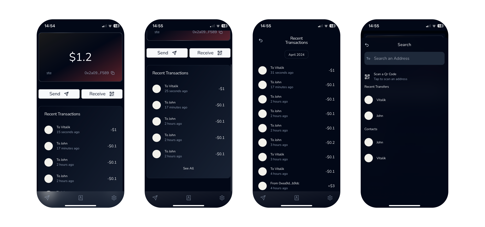
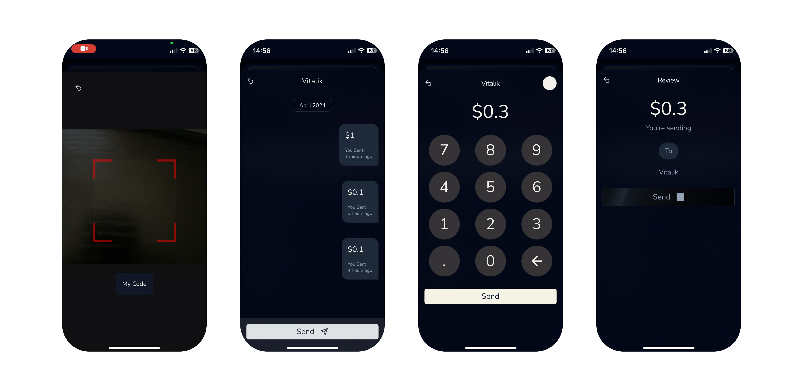
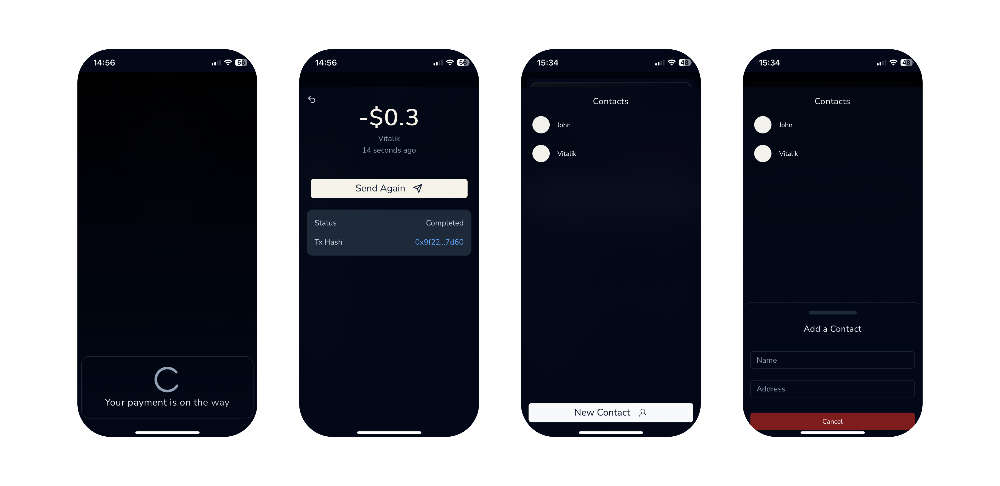

# Payments PWA

## Description

My final year thesis is a Fintech Payments PWA built on the Base Blockchain.

## Built using

- React
- Next JS
- Redux
- ZeroDev Account Abstraction
- Privy
- Viem
- Tailwind
- ShadCN

https://github.com/Stephen-Gordon/payments/assets/91547618/9f831222-5382-4d34-853a-f1d6e9beb585

## Screenshots

  

  

  

## Connect With Me

- LinkedIn: [Stephen Gordon](https://www.linkedin.com/in/ste-gordon/)
- [Portfolio](https://www.stephengordon.ie)
